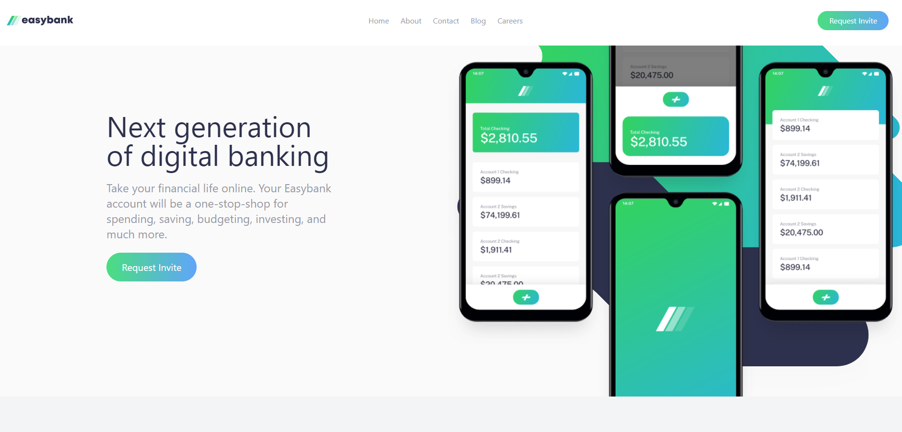
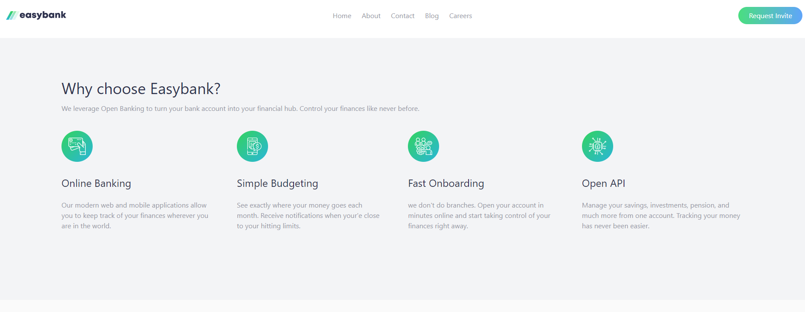
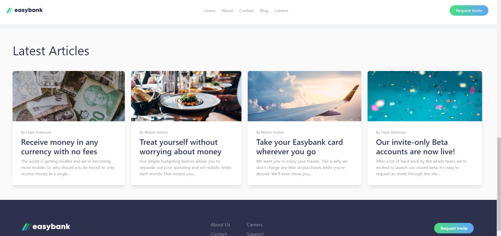
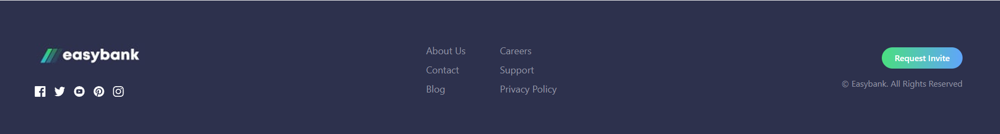
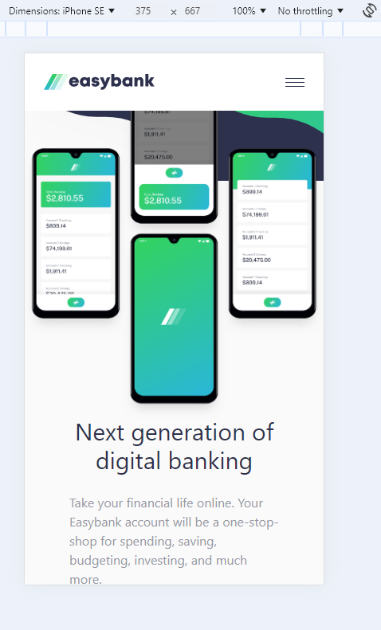
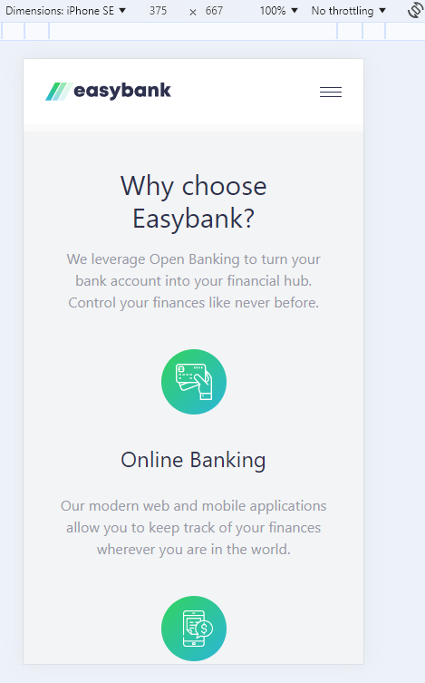
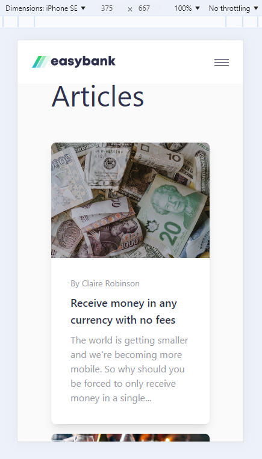
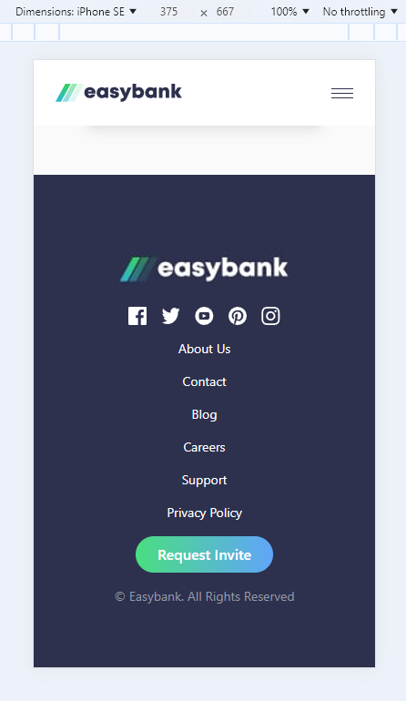

# Easybank Landing Page

This project involved developing the Easybank landing page with a focus on both mobile and desktop responsiveness. Key features include a navigation bar, a side navigation bar for mobile, a responsive design, a TailwindCSS layout, a footer, interactive hover states and much more.

## Table of contents

- [Overview](#overview)
  - [The challenge](#the-challenge)
  - [Screenshots](#screenshots)
  - [Links](#links)
- [My process](#my-process)
  - [Built with](#built-with)
  - [What I learned](#what-i-learned)
  - [Continued development](#continued-development)
  - [Useful resources](#useful-resources)
- [Author](#author)

## Overview

This project involved replicating a design layout given for desktop and mobile for a Easybank Landing Page with special features.

### The challenge

Users should be able to:

- View the optimal layout for the site depending on their device's screen size
- See hover states for all interactive elements on the page

### Screenshots

Desktop Version:

Mobile Version:

### Links

- Live Site URL: [Easybank Landing Page Laura Dev](https://easybank-project-lauradev.netlify.app/)
- Solution URL: [Frontend Mentor Solution]()

### My Process

I began by setting up TailwindCSS, ReactJS, and my GitHub repository. Additionally, I configured the README template, added all design assets, integrated Google Fonts, and defined the color scheme. I ensured that all commits were successfully pushed to GitHub before beginning my project.

Next, I reviewed the design layout to determine which sections would be components and reusable components. I started by working on the desktop navigation bar first as I wanted to begin my coding process starting from the top of the website page to the bottom. My goal for this project was to implement all design features and core functionality in the initial coding phase. I included background gradients to my navigation button as well as hover states with the border underline. Next, I focused on the splash/landing page, showcasing the main image and headline. I was able to create a flexbox layout that would showcase all information accurately based on the design.

Next, I worked through each section starting with the "Why Easybank" and moving to the "Articles" section. Much of this process involved trial and error to receive the best possible desktop layout. In the Articles section, I was able to create a reusable card component for all the articles that made that area look uniform. The reusable card component was a great success as it looked great and was easy to replicate in the mobile version.

Finally, I worked on the Footer which involved adding social media logos, Easybank logo, more text links and a copyright statement. This process was straightforward as it involved importing the images and using flexbox for the layout.

Once the general layout of the desktop version was complete, I reviewed the project to identify any remaining details. I worked on adding hover states to the buttons, putting a fixed position on the navigation bar when scrolling and aligning the text to the left in specific areas. I worked on the mobile design and responsiveness of the the project by adding an interactive side navigation bar. I was able to use useState and a handleOnClick function to open and close the side nav bar.

Overall, this project continued to work on my design understanding, flexbox knowledge and mobile responsiveness. I enjoyed doing this project and learning more about TailwindCSS and ReactJS.

### Built with

- Semantic HTML5 markup
- CSS custom properties
- Flexbox
- CSS Grid
- Mobile-first workflow
- [React](https://reactjs.org/) - JS library

### What I learned

There are several things I learned throughout this project:

1. **Gradient Colors** - I learned how to add gradient colors to all my buttons. This involved adding a TailwindCSS class with a call of background gradient starting from the right with blue to green. This process was called using background gradients based on a color stop. Additionally, I added a hover state with a gradient for all buttons.
2. **Card Component** - I was able to make a card component to be used in the articles section multiple times. I created a card component separately that accepted props for dynamic content. I was able to pass through title, content, image and author. Through this I could iterate over the component multiple times in order to get the desired effect and content. I worked on stretching the image on the card component the full width and length of the top of the component.
3. **Flexbox Design** - I continued to learn more about flexbox and reinforce my understanding of flexbox. I was more challenged on the splash page image with flexbox as it was more challenging to find the right image size and overlay.

### Continued development

I will continue to learn more about TailwindCSS, ReactJS and updating my process of building a website. I want to specifically work on learning more TailwindCSS design properties to add to my coding toolbox.

### Useful resources

- [Public Sans Google Font](https://fonts.google.com/specimen/Public+Sans) - Design called for this font in the project.
- [Gradient Colors](https://tailwindcss.com/docs/gradient-color-stops) - This style from TailwindCSS allows for gradients colors.

## Author

- Website - [Laura V](www.lauradeveloper.com)
- Frontend Mentor - [@lavollmer](https://www.frontendmentor.io/profile/lavollmer)
- Github - [@lavollmer](https://github.com/lavollmer)
